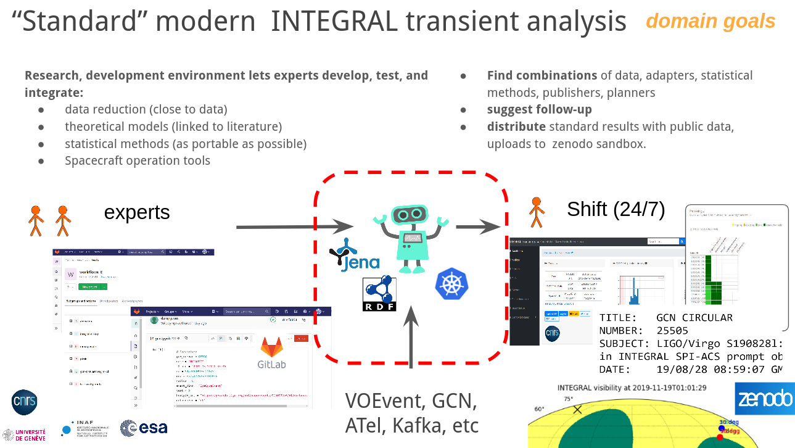

# Workflow Publishing and Discovery with KG: Old-School Astronomer Guide

## Purpose of this note

We want to demostrate on concrete and scientifically-useful working examples how an **astronomer**, who might indeed have relatively little interest to look in the code, can leverage **ODA Knowledge Base** and **Knowledge Graphs** together with other valuable resources (especially [Renku](renkulab.io/)):
* **collaborate** on workflows
* **discover and use** ODA-built services
* use our record of globally available web-based data analysis services
* easily **contribute** your own analysis as web-servces
* annotate your work in the ways ready for consumption by our **robots**



## Developing the workflow

The simplest way to build a workflow is to write a **jupyter notebook**. We will not go in every details here, see [dedicated guide](https://github.com/oda-hub/guide-to-create-workflows/) for step-by-step instructions.

Instead, this document here focuses on workflow annotation, publishing, and discovery.
These features are powered by an **RDF Knowledge Graph**. What exactly is stored in the Knowledge Graph, is described by the **ontologies** (which are themselves stored in some KG). 

## Ontology

We will describe here the simplest elements of the ontology, which are necessary for workflow annotation.

**Ontology** describes relations between some **things**, **terms** (represented as [RDF URIs](https://www.w3.org/TR/rdf11-concepts/#dfn-iri)). **URI** can look like a URL, e.g. https://odahub.io/ontology/sources/Mrk421 (the URL may or may not be leading to a real location, although it generally should). The **URI** can be also shortened, assuming a namespace prefix:

```rdf
PREFIX odaSources: <https://odahub.io/ontology/sources#>
```

(see some default list of prefixes [here](http://ontology.odahub.io/defaults/defaults.yaml))

This way, https://odahub.io/ontology/sources/Mrk421 becomes `odaSources:Mrk421`.

It is necessary to annotate the workflow with these **terms**. Specifically, to make relations between the **workflow** and these **terms**. Relations have a form of simply propositions, expressed as **subject-predicate-object** **triples**.

For example

```rdf
oda:sdssWorkflow oda:isImportantIn oda:radioAstronomy .
```

or

```rdf
oda:sdssWorkflow astroquery:uses astroquery:sdssArchive .
```

```rdf
oda:sdssWorkflow oda:isAbout odaSources:Mrk421 .
```

Consider that it is benefitial to use terms already used by other people, described in existing ontologies. This way we speak in the same language as other people, and will be able to more easily combine our resources.
However, it can be quite an effort to understand what other people meant, which is necessary to use their terms correctly. This effort should be made conciously when possible. It is advisable to also discuss unclear points withing our group, and come to a common solution.

It is however, often important to adopt project-specific narrowed-down scope. For example, our understanding of what an `AGN` is, may differ from that of `CDS-Strasbourg`. Which is why, in unclear cases, we should not hesitate to use custom terms, such as `odaSources:AGN`. Then, we can also model and encode equivalence between our own understanding of the `AGN` with that of `CDS`. For example, as so:

```rdf
odaSources:Mrk421 oda:isSubclassOf odaSources:AGN .
odaSources:AGN oda:equivalentTo cds:AGN .
```

Later, these equivalences can be reduced under specific assumptions: for example some agent may assume that `oda:equivalentTo` implies literal substitution in all contexts.


### Workflow inputs

For our purposes, the most important relation

```python
name_input = "Mrk 421" # name of the object; if empty coordinates are used http://odahub.io/ontology/sources/mrk421
radius_input = 3.0 # arcmin
```

They can be see for example with 
```bash
$ nbinspect final.ipynb
...
"name_input": {
        "comment": " name of the object; if empty coordinates are used",
        "default_value": "Mrk 421",
        "name": "name_input",
        "owl_type": "http://www.w3.org/2001/XMLSchema#str",
        "python_type": "<class 'str'>",
        "value": "Mrk 421"
    },
...
"radius_input": {
        "comment": " arcmin",
        "default_value": 3.0,
        "name": "radius_input",
        "owl_type": "http://www.w3.org/2001/XMLSchema#float",
        "python_type": "<class 'float'>",
        "value": 3.0
    }
...
```
Will IVOA vocabulaires, and references therein https://www.ivoa.net/rdf/index.html. One should pay particular attention the developments used in variety of tables managed by CDS-Strasbourg, where much of the needed terms for astrophysical entities can be found (one can start [here](https://www.ivoa.net/documents/UCD1+/)).
It is true that

Should 

### Other Domain-specific knowledge


## From Workflow to Web-Based Data Analysis

We want to 

## Reasoning engines

## 

workflow
